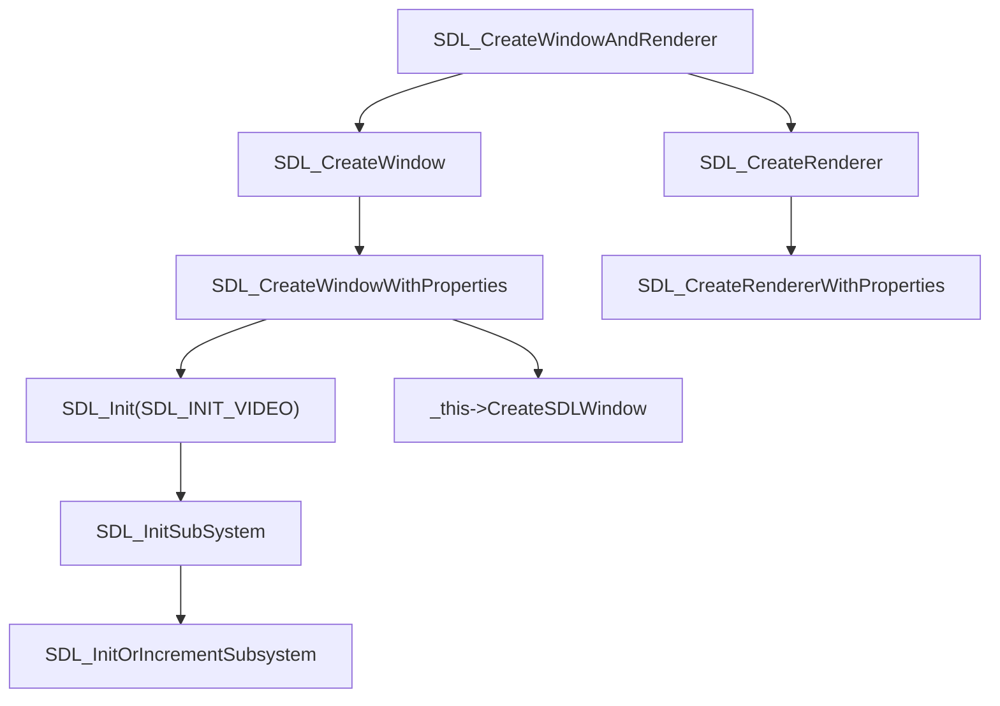
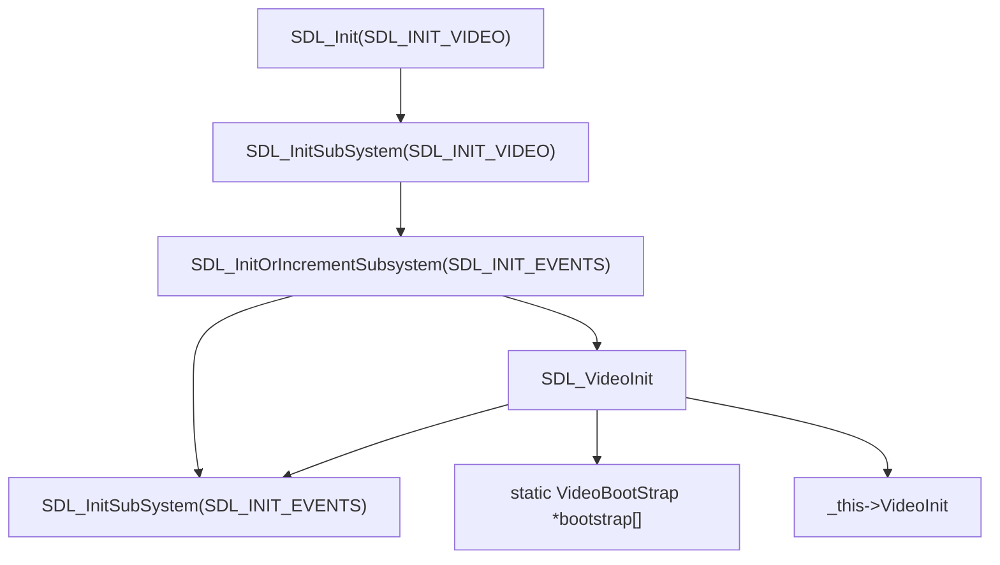
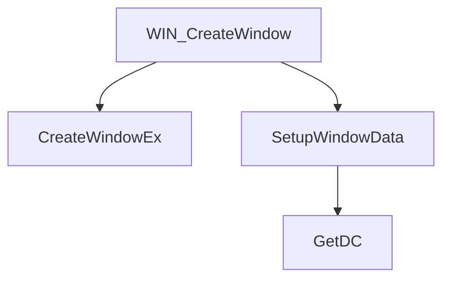
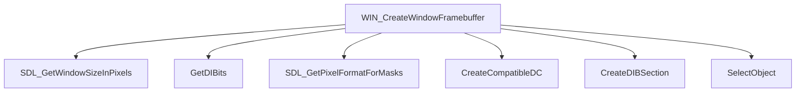
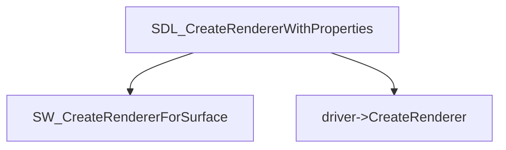
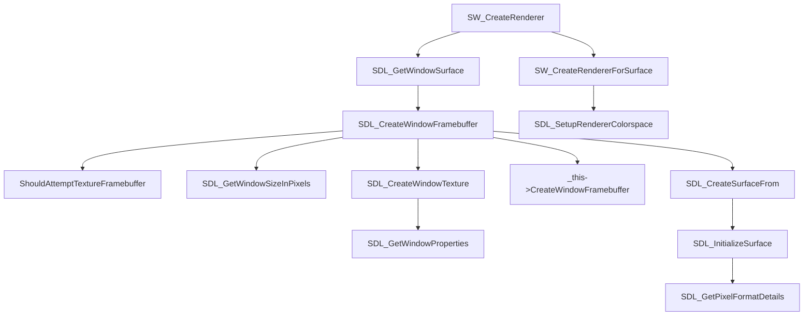

基于的 SDL 源码分支: [3.4.4](https://github.com/WSQS/SDL/tree/feat/doc-3.4.4)

## Window

暴露给用户的入口函数`SDL_CreateWindowAndRenderer`。

调用链：



- `SDL_CreateWindowAndRenderer`: 约束一下创建参数，并随后调用`SDL_CreateWindow`和`SDL_CreateRenderer`
- `SDL_CreateWindow`: 创建一个SDL Properties并将其传递给`SDL_CreateWindowWithProperties`
- `SDL_CreateRenderer`: 创建一个SDL Properties并将其传递给`SDL_CreateRendererWithProperties`
- `SDL_CreateWindowWithProperties`
  - 检测并初始化Video子系统
  - 处理和检查各种参数属性
  - 创建`SDL_Window`对象
  - 调用`_this->CreateSDLWindow`

### SDL_Init(SDL_INIT_VIDEO)

调用链：



对SDL的窗口子系统进行初始化，因为还涉及到了输入事件，所以依赖事件子系统先进行初始化。

对实现进行抽象和多平台支持是由`bootstrap`这个静态数组指针来实现的，在编译时根据宏动态添加数组元素。`VideoBootStrap`定义了每个后端的接口。

```c
typedef struct VideoBootStrap
{
    const char *name;
    const char *desc;
    SDL_VideoDevice *(*create)(void);
    bool (*ShowMessageBox)(const SDL_MessageBoxData *messageboxdata, int *buttonID);  // can be done without initializing backend!
    bool is_preferred;
} VideoBootStrap;
```

`VideoBootStrap::create`得到的`SDL_VideoDevice`提供了真正实现跨平台功能的函数，`create`的职责就是装配`SDL_VideoDevice`结构体。

### Windows Video Device

Windows 平台的`VideoBootStrap`实例是`WINDOWS_bootstrap`。

|     SDL_VideoDevice     |           Windows           |
| :---------------------: | :-------------------------: |
|     CreateSDLWindow     |      WIN_CreateWindow       |
| CreateWindowFramebuffer | WIN_CreateWindowFramebuffer |

#### WIN_CreateWindow

调用链：



- `WIN_CreateWindow`: 首先会判断是基于已有窗口，还是调用`CreateWindowEx`创建新窗口。
- `SetupWindowData`: 创建并初始化`SDL_WindowData`对象，并保存为`window->internal`。
  - 调用`GetDC`通过`hwnd`来获得`hdc`
    - `hwnd`(Handle to WiNDow)
    - `hdc`(Handle to Device Context)
    - [参考文档](https://learn.microsoft.com/en-us/windows/win32/api/winuser/nf-winuser-getdc)

#### WIN_CreateWindowFramebuffer

调用链：



- `WIN_CreateWindowFramebuffer`: 对传入的窗口，返回窗口像素格式、像素内存指针、每行的字节数。
  - 调用`SDL_GetWindowSizeInPixels`获取窗口的像素尺寸
  - 准备`LPBITMAPINFO`对象
  - 调用`GetDIBits`两次获取像素格式信息
  - 对带有颜色掩码的情况，调用`SDL_GetPixelFormatForMasks`来获取像素格式
  - 否则就根据是否有Alpha通道，强行设定为`SDL_PIXELFORMAT_BGRA32`或`SDL_PIXELFORMAT_XRGB8888`
  - 设定`LPBITMAPINFO`对象当中的尺寸信息
  - 调用`CreateCompatibleDC`基于`hdc`来创建一个适配的`hdc`，也就是内存`hdc`，`mdc`
  - 调用`CreateDIBSection`基于`hdc`创建DBI(Device Independent Bitmap)设备无关位图，得到`hbm`
  - 调用`SelectObject`来将`mdc`和`hbm`建立关联，基于`mdc`的操作会写入到`hbm`当中。

### SDL_CreateRendererWithProperties

调用链：



`SDL_CreateRendererWithProperties`会处理传入window或surface两种参数的情况，对传入surface的情况，会调用`SW_CreateRendererForSurface`，否则会调用`driver->CreateRenderer`。

与`SDL_VideoInit`类似，`SDL_CreateRendererWithProperties`是基于静态指针数组`render_drivers`进行抽象和多后端支持的。

```c
// Define the SDL render driver structure
struct SDL_RenderDriver
{
    bool (*CreateRenderer)(SDL_Renderer *renderer, SDL_Window *window, SDL_PropertiesID props);

    const char *name;
};
```

### Software Renderer

软件渲染的`SDL_RenderDriver`实例是`SW_RenderDriver`

#### SW_CreateRenderer

调用链：



- `SDL_CreateWindowFramebuffer`:
  - 根据`ShouldAttemptTextureFramebuffer`判断是否可以进行硬件加速。如果支持，那么会根据尝试调用`SDL_CreateWindowTexture`或者装载对应的函数指针到`_this`中去。
  - 对未创建`FrameBuffer`的情况，会调用`_this->CreateWindowFramebuffer`
  - 最终调用`SDL_CreateSurfaceFrom`来创建`surface`。
- `SDL_InitializeSurface`: 对传入的`SDL_Surface`对象进行初始化。
- `SW_CreateRendererForSurface`: 初始化Render参数和函数指针。

## Properties
